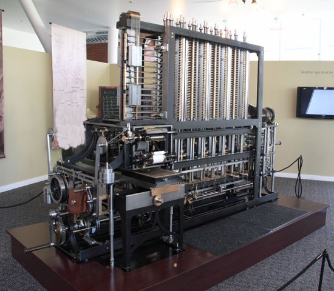
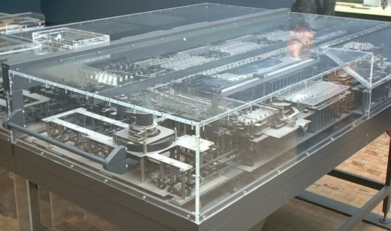
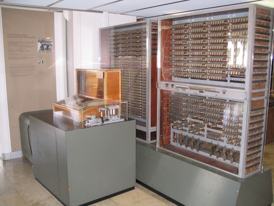
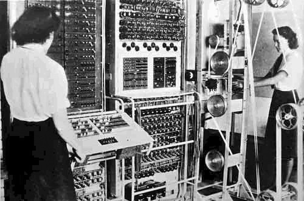
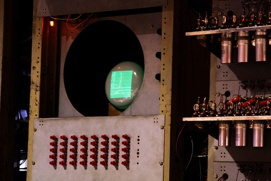
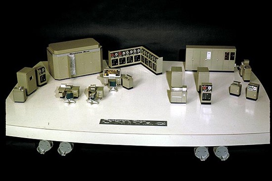
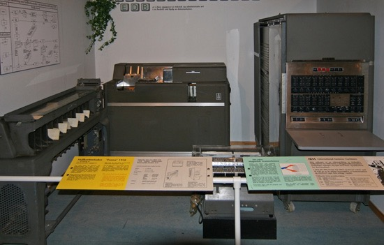
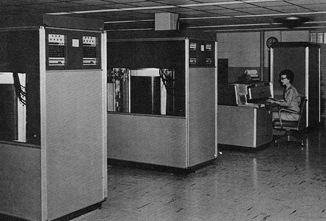
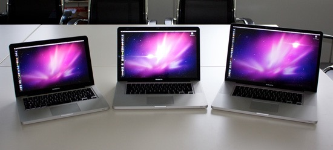
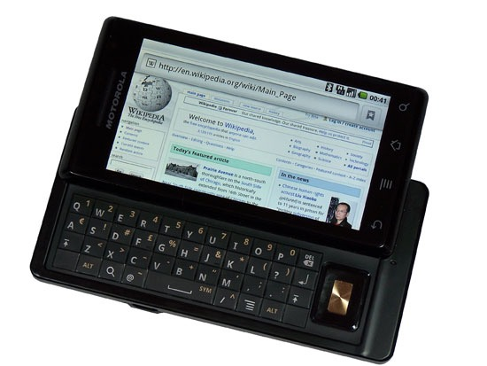

# The History of Computers {#the-history-of-computers}

Computers have wedged themselves into every facet of our lives—they are what we would use as the symbolic representation of the modern world.

But did you know that the history of computers dates back to the 1800s?

Indeed, the history and evolution of computers is quite extraordinary—and with many early computing technology innovations tied to defense contracts, much of this information were kept secret from the public for decades. In this article, we explore the development and progression of computers.

## Mid-1800s-1930s: Early Mechanical Computers {#mid-1800s-1930s}

The first computers were designed by Charles Babbage in the mid-1800s, and are sometimes collectively known as the Babbage Engines. These include the Difference Engine No. 1, the Analytical Engine, and the Difference Engine No. 2.

The <b>Difference Engine</b> was constructed from designs by Charles Babbage. Photo by Allan J. Cronin

These early computers were never completed during Babbage’s lifetime, but their complete designs were preserved. Eventually, one was built in 2002.

[See the 1930s](#1930s)

While these early mechanical computers bore little resemblance to the computers in use today, they paved the way for a number of technologies that are used by modern computers, or were instrumental in their development. These concepts include of the idea of separating storage from processing, the logical structure of computers, and the way that data and instructions are inputted and outputted.

**Z1** was used to take the U.S. Census in 1890\.

Other important mechanical computers are the Automatic Electrical Tabulating Machine—which was used in the U.S. Census of 1890 to handle data from more than 62 million Americans—and the first binary computer: Konrad Zuse’s Z1, which was developed in 1938 and was the precursor to the first electro-mechanical computer.

## 1930s: Electro-Mechanical Computers {#1930s}

Electro-mechanical computers generally worked with relays and/or vacuum tubes, which could be used as switches.

Some electro-mechanical computers—such as the Differential Analyzer built in 1930—used purely mechanical internals but employed electric motors to power them.

These early electro-mechanical computers were either analog or were digital—such as the Model K and the Complex Number Calculator, both produced by George Stibitz.

Stibitz, by the way, was also responsible for the **first** remote access **computing**, done at a conference at Dartmouth College in New Hampshire. He took a teleprinter to the conference, leaving his computer in New York City, and then proceeded to take problems posed by the audience. He then entered the problems on the keypad of his teleprinter, which outputted the answers afterward.

**Z3** used floating-point numbers which improved the accuracy of calculations.

It was during the development of these early electro-mechanical computers that many of the technologies and concepts still used today were first developed. The Z3, a descendent of the Z1 developed by Konrad Zuse, was one such pioneering computer. The Z3 used floating-point numbers in computations and was the first program-controlled digital computer.

Other electro-mechanical computers included Bombes, which were **used during WWII to decrypt German codes**.

## 1940s: Electronic Computers

**Colossus**—whose name was fitting for its size—was developed during World War II.

The first electronic computers were developed during the World War II, with the earliest of those being the Colossus. The Colossus was developed to decrypt secret German codes during the war. It used vacuum tubes and paper tape and could perform a number of Boolean (e.g. true/false, yes/no) logical operations.

**Williams Tube** used RAM for its computations.

Another notable early electronic computer was nicknamed "The Baby" (officially known as the Manchester Small-Scale Experimental Machine). While the computer itself wasn’t remarkable—it was the first computer to use the Williams Tube, a type of **random access memory** (RAM) that used a cathode-ray tube.

Some early electronic computers used decimal numeric systems (such as the ENIAC and the Harvard Mark 1), while others—like the Atanasoff-Berry Computer and the Colossus Mark 2—used binary systems. With the exception of the Atanasoff-Berry Computer, all the major models were programmable, either using punch cards, patch cables and switches, or through stored programs in memory.

## 1950s: The First Commercial Computers

The first commercially available computers came in the 1950s. While computing up until this time had mainly focused on scientific, mathematical, and defense capabilities, new computers were designed for business functions, such as banking and accounting.

The J. Lyons Company, which was a British catering firm, invested heavily in some of these early computers. In 1951, LEO (Lyons Electronic Office) became the first computer to run a regular routine office job. By November of that year, they were using the LEO to run a weekly bakery valuations job.

The **UNIVAC** was the first mass-produced computer.

The UNIVAC was the first commercial computer developed in the U.S., with its first unit delivered to the U.S. Census Bureau. It was the **first mass-produced computer**, with more than 45 units eventually produced and sold.

The IBM 701 was another notable development in early commercial computing; it was the first mainframe computer produced by IBM. It was around the same time that the **Fortran programming language** was being developed (for the 704).

The **IBM 650** would cost you $4 million dollars if you bought it today.

A smaller IBM 650 was developed in the mid-1950s, and was popular due to its smaller size and footprint (it still weighed over 900kg, with a separate 1350kg power supply).

They cost the **equivalent of almost $4 million** today (adjusted for inflation).

## Mid-1950s: Transistor Computers {#mid-1950s}

The development of transistors led to the replacement of vacuum tubes, and resulted in significantly smaller computers. In the beginning, they were less reliable than the vacuum tubes they replaced, but they also consumed significantly less power.

**IBM 350 RAMAC** used disk drives.

These transistors also led to developments in **computer peripherals**. The first disk drive, the IBM 350 RAMAC, was the first of these introduced in 1956\. Remote terminals also became more common with these second-generation computers.

## 1960s: The Microchip and the Microprocessor

The microchip (or integrated circuit) is one of the most important advances in computing technology. Many overlaps in history existed between microchip-based computers and transistor-based computers throughout the 1960s, and even into the early 1970s.

**Micochips** allowed the manufacturing of smaller computers. Photo by Ioan Sameli

The microchip spurred the production of minicomputers and microcomputers, which were small and inexpensive enough for small businesses and even individuals to own. The microchip also led to the microprocessor, another breakthrough technology that was important in the development of the personal computer.

There were three microprocessor designs that came out at about the same time. The first was produced by Intel (the 4004). Soon after, models from Texas Instruments (the TMS 1000) and Garret AiResearch (the Central Air Data Computer, or CADC) followed.

The first processors were 4-bit, but 8-bit models quickly followed by 1972.

16-bit models were produced in 1973, and 32-bit models soon followed. AT&T Bell Labs created the first fully 32-bit single-chip microprocessor, which used 32-bit buses, 32-bit data paths, and 32-bit addresses, in 1980.

The first 64-bit microprocessors were in use in the early 1990s in some markets, though they didn’t appear in the PC market until the early 2000s.

## 1970s: Personal Computers

The first personal computers were built in the early 1970s. Most of these were limited-production runs, and worked based on small-scale integrated circuits and multi-chip CPUs.

The Commodore PET was a personal computer in the 70s. Photo by Tomislav Medak

The Altair 8800 was the first popular computer using a single-chip microprocessor. It was also sold in kit form to electronics hobbyists, meaning purchasers had to assemble their own computers.

Clones of this machine quickly cropped up, and soon there was an entire market based on the design and architecture of the 8800\. It also spawned a club based around hobbyist computer builders, the **Homebrew Computer Club**.

1977 saw the rise of the "**Trinity**" (based on a reference in Byte magazine): the Commodore PET, the Apple II, and the Tandy Corporation’s TRS-80\. These three computer models eventually went on to sell millions.

These early PCs had between 4kB and 48kB of RAM. The Apple II was the only one with a full-color, graphics-capable display, and eventually became the best-seller among the trinity, with more than 4 million units sold.

## 1980s-1990s: The Early Notebooks and Laptops

One particularly notable development in the 1980s was the advent of the commercially available portable computer.

**Osborne 1** was small and portable enough to transport. Photo by Tomislav Medak

The first of these was the **Osborne 1**, in 1981\. It had a tiny 5" monitor and was large and heavy compared to modern laptops (weighing in at 23.5 pounds). Portable computers continued to develop, though, and eventually became streamlined and easily portable, as the notebooks we have today are.

These early portable computers were portable only in the most technical sense of the word. Generally, they were anywhere from the size of a large electric typewriter to the size of a suitcase.

The **Gavilan SC** was the first PC to be sold as a "laptop".

The **first laptop with a flip form factor**, was produced in 1982, but the first portable computer that was actually marketed as a "laptop" was the Gavilan SC in 1983.

Early models had monochrome displays, though there were color displays available starting in 1984 (the Commodore SX-64).

Laptops grew in popularity as they became smaller and lighter. By 1988, displays had reached VGA resolution, and by 1993 they had 256-color screens. From there, resolutions and colors progressed quickly. Other hardware features added during the 1990s and early 2000s included high-capacity hard drives and optical drives.

**Laptops** typically come in three categories, as shown by these Macbooks. Photo by Benjamin Nagel

Laptops are generally broken down into a three different categories:

Desktop replacements

Standard notebooks

Subnotebooks

Desktop replacements are usually larger, with displays of 15-17" and performance comparable with some better desktop computers.

Standard notebooks usually have displays of 13-15" and are a good compromise between performance and portability.

Subnotebooks, including netbooks, have displays smaller than 13" and fewer features than standard notebooks.

## 2000s: The Rise of Mobile Computing

Mobile computing is one of the most recent major milestones in the history of computers.

Many smartphones today have higher processor speeds and more memory than desktop PCs had even ten years ago. With phones like the iPhone and the Motorola Droid, it’s becoming possible to perform most of the functions once reserved for desktop PCs from anywhere.

The **Droid** is a smartphone capable of basic computing tasks such as emailing and web browsing.

Mobile computing really got its start in the 1980s, with the pocket PCs of the era. These were something like a cross between a calculator, a small home computer and a PDA. They largely fell out of favor by the 1990s. During the 1990s, PDAs (Personal Digital Assistant) became popular.

A number of manufacturers had models, including Apple and Palm. The main feature PDAs had that not all pocket PCs had was a touchscreen interface. PDAs are still manufactured and used today, though they’ve largely been replaced by smartphones.

Smartphones have truly revolutionized mobile computing. Most basic computing functions can now be done on a smartphone, such as email, browsing the internet, and uploading photos and videos.

## Late 2000s: Netbooks

Another recent progression in computing history is the development of netbook computers. Netbooks are smaller and more portable than standard laptops, while still being capable of performing most functions average computer users need (using the Internet, managing email, and using basic office programs). Some netbooks go as far as to have not only built-in WiFi capabilities, but also built-in mobile broadband connectivity options.

The **Asus Eee PC 700** was the first netbook to enter mass production.

The first mass-produced netbook was the Asus Eee PC 700, released in 2007\. They were originally released in Asia, but were released in the US not long afterward.

Other manufacturers quickly followed suit, releasing additional models throughout 2008 and 2009.

One of the main advantages of netbooks is their lower cost (generally ranging from around US$200-$600). Some mobile broadband providers have even offered netbooks for free with an extended service contract. Comcast also had a promotion in 2009 that offered a free netbook when you signed up for their cable internet services.

Most netbooks now come with Windows or Linux installed, and soon, there will be Android-based netbooks available from Asus and other manufacturers.

The history of computing spans nearly two centuries at this point, much longer than most people realize. From the mechanical computers of the 1800s to the room-sized mainframes of the mid-20th century, all the way up to the netbooks and smartphones of today, computers have evolved radically throughout their history.

The past 100 years have brought technological leaps and bounds to computing, and there’s no telling what the next 100 years might bring.